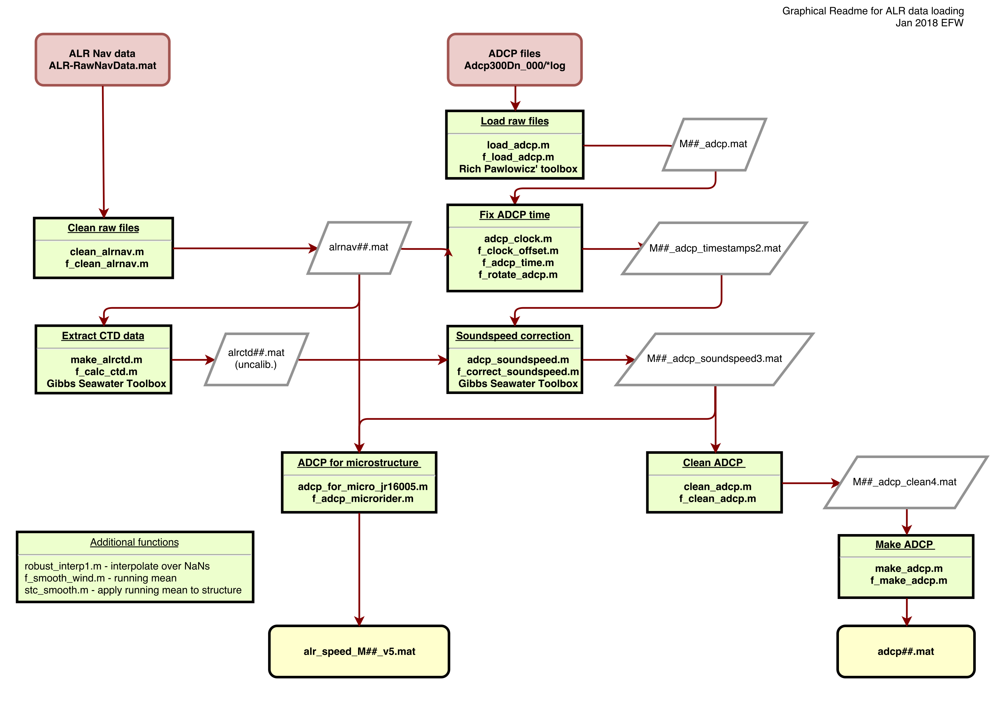

Script make_dataset.m for data from Autosub Long Range
- calls the data loading/cleaning scripts in the right order

See also ALR_processing_flowchart.pdf

Requires ADCP processing software from Rich Pawlowicz:
 https://www.eoas.ubc.ca/~rich/#RDADCP

Requires Gibbs TEOS10 seawater toolbox 
 http://www.teos-10.org/software.htm

See comments in make_dataset.m for more information

Data files for the M44 mission on the DynOPO cruise in 2017 can be found [here (286mb), *.000 for ADCP and Matlab format files](https://www.dropbox.com/scl/fo/ib3flszxo8518jhelfcy9/AC-DX8PZPxzkI3Vn7W_sNRo?rlkey=ic67rwww0lgedy59po48lbdb7&dl=0)

Updated Jan 2018 - EFW

See also 
